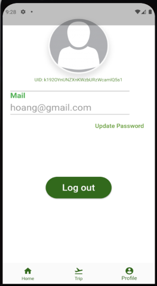
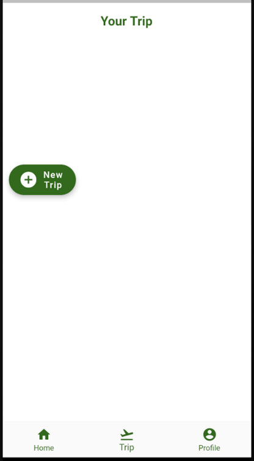
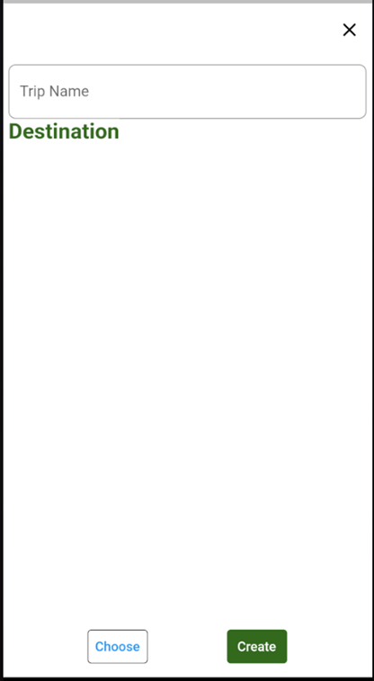
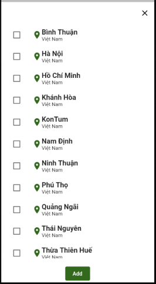
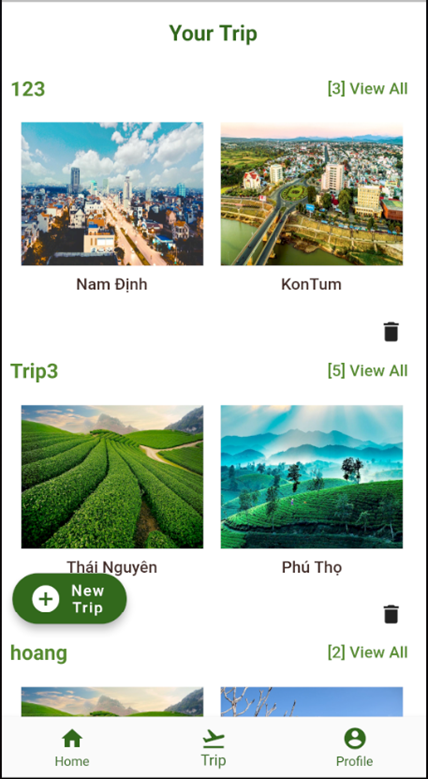
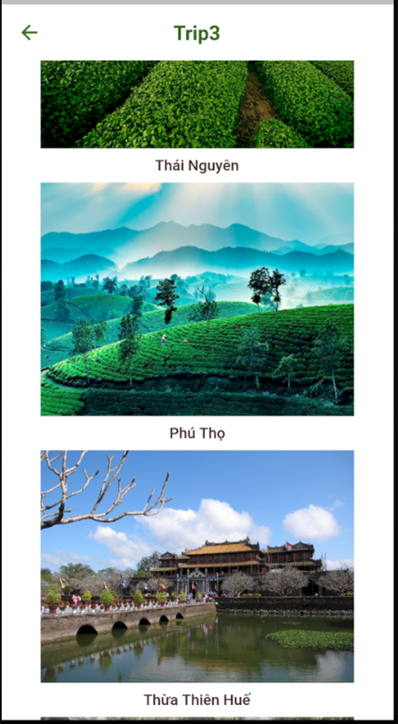
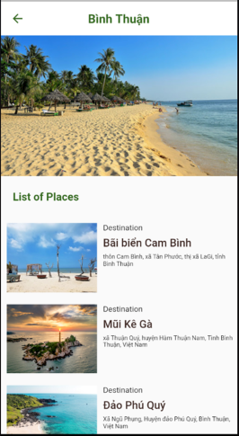
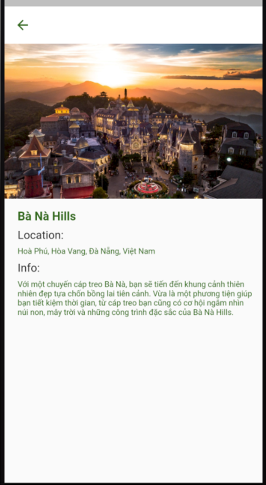
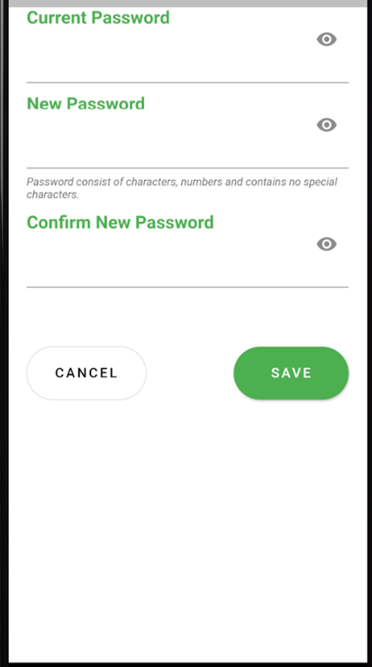
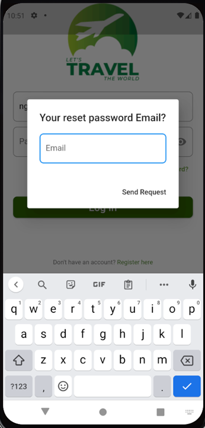

# MyTrip
## Table of contents
* [Giới thiệu chung](#Giới-thiệu-chung)
* [Các chức năng](#Các-chức-năng)
* [Các màn hình khác](#Các màn hình khác)
* [Thư viện và công nghệ](#Thư-viện-và-công-nghệ)
* [Tác giả](#Tác-giả)
## Giới thiệu chung
Trong thời đại xã hội ngày càng phát triển và nhu cầu giải trí, thư giãn của con người cũng ngày một tăng lên thì đi du lịch và khám phá những địa điểm du lịch là một trong những điều tất yếu. Tuy nhiên, không phải ai cũng có thể biết được tất cả những địa điểm thú vị cũng như thông tin về những địa điểm của những địa phương mà mình sắp đến. Do đó, chúng ta cần những ứng dụng để có thể cung cấp được danh sách những địa điểm nổi bật ở các địa phương cũng như cung cấp được địa chỉ và thông tin của những địa điểm đó để giúp chúng ta có trải nghiệm tốt nhất với chuyến du lịch của mình. 

Sau quá trình tìm hiểu và nắm bắt được tình hình trên, cùng với việc đề ra phương hướng giải quyết, nhóm chúng tôi đã đặt ra mục tiêu xây dựng một phần mềm hỗ trợ du lịch trên điện thoại. Với những chức năng đơn giản và giúp người dùng dễ sử dụng, phần mềm có tên gọi là “My Trip”. 
## Các chức năng
1. Đăng nhập 

2. Đăng ký

3. Đăng xuất

4. Tạo Trip

5. Tham khảo thông tin địa điểm

6. Đổi ảnh đại diện

7. Đổi mật khẩu

8. Quên mật khẩu 

## Các giao diện khác
1. Giao diện khởi động

2. Giao diện trang chủ 

## Thư viện và công nghệ
1. Công nghệ:

Đồ án sử dụng nền tảng Flutter với ngôn ngữ lập trình Dart và quản lý cơ sở dữ liệu trên Firebase

2. Thư viện:

Một số thư viện mà đồ án sử dụng:
* Thư viện firebase
>firebase_auth: ^1.3.0

>firebase_storage:

>firebase_database:

>cloud_firestore:

>firebase_core:

* Thư viện CarouselSlider
> carousel_slider:

* Thư viện lấy ảnh từ Gallery
>  image_picker:

* Ngoài ra còn một số thư viện xử lý khác:
> animated_splash_screen: ^1.1.0

>cupertino_icons: ^1.0.2

>provider: ^5.0.0

>email_validator: ^2.0.1

>fluttertoast: ^8.0.7
## Tác giả
Đây là đồ án lập trình android của nhóm Minh, Hoàng, Long - SE346.L21.PMCL ĐH Công Nghệ Thông Tin - ĐH Quốc Gia Thành Phố Hồ Chí Minh. 
Tác giả: Nguyễn Huy Hoàng, Sơn Ngọc Minh, Trần Hoàng Long.

